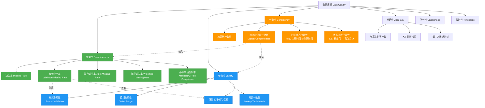

# 数据质量维度关系图



## 图解说明

| 区块 | 说明 |
|------|------|
| 🟩 **绿色：完整性** | 关注“是否应填尽填”，你提出的所有指标（缺失率、有效非空率等）都归属或服务于这一维度 |
| 🔵 **蓝色：有效性** | 关注“是否符合预定义格式与规则”，为“有效非空率”提供判断依据 |
| 🟠 **橙色：一致性** | 关注“跨字段/跨系统是否合理”，你提到的“逻辑完整性”真正归属于此 |
| ⬅️ **箭头虚线** | 表示“依赖关系”：例如“有效非空率”的计算依赖“有效性规则” |

## 特别说明：关于“有效非空率”的定位

在图中：

- “**有效非空率**” 属于 **完整性维度**
- 但它 **依赖于有效性规则** 来判断一个非空值是否“真正有效”

👉 这体现了实际业务中的常见做法：
> 我们仍然希望回答“这个字段有多完整？”，但答案不再只是“非空比例”，而是“**既非空又合法的比例**”。

## 可扩展建议

你还可以在此基础上增加：

1. 增加“数据丰度指数”作为顶层指标

    ```mermaid
    H[数据丰度指数] --> B
    H --> C
    H --> D
    ```

2. 增加“监控场景”应用层

    ```mermaid
    UseCase[应用场景] --> UC1[建模数据准入]
    UseCase --> UC2[监管合规报告]
    UseCase --> UC3[客户分层分析]

    UC1 --> B2
    UC1 --> D2
    UC2 --> B5
    UC3 --> H
    ```
